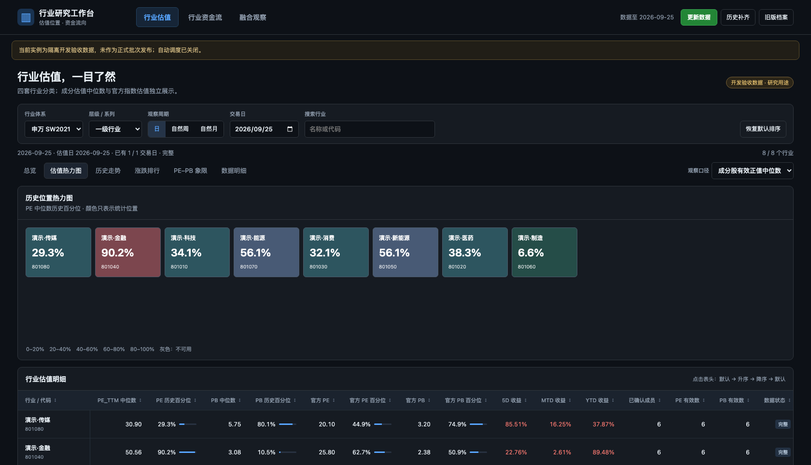
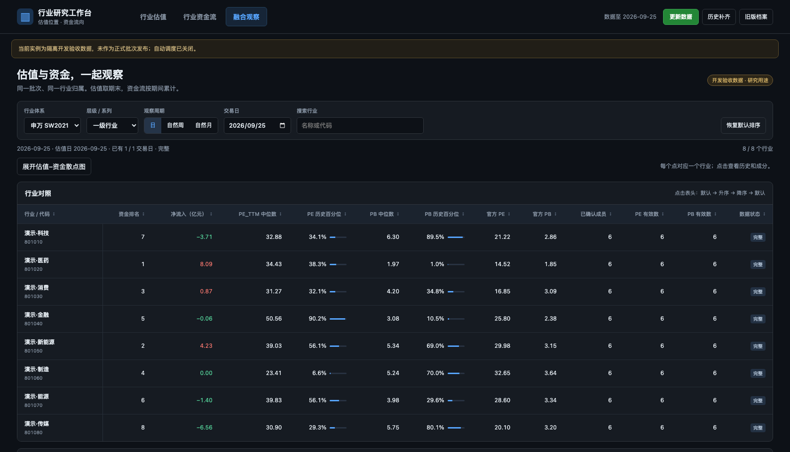

# A 股行业估值与资金流工作台

[](https://opensource.org/licenses/Apache-2.0)

> 版权所有 © 2026 chen1pengvincent。本项目基于 [Apache License 2.0](LICENSE) 发布。

一次启动，在同一网址查看行业估值、行业资金流和融合分析。三个页面共用 Tushare 数据、真实行业身份、历史归属和发布批次，覆盖申万、同花顺、通达信、中信。

估值页保留总览、热力图、走势、涨跌排行、PE–PB 散点、明细及成分股入口。自然周、自然月使用期末交易日估值和期间净流入；无法证实的历史归属留空。官方 PE/PB 与成分股正值中位数分别展示，所有列表支持默认、升序、降序切换。

## 界面预览

> 截图为本地运行的**虚拟演示数据**（开发验收模式注入），行业名称与所有数值均为演示用途，非真实行情。

| 行业估值：历史位置热力图与估值明细 | 融合观察：估值与资金流同表对照 |
| --- | --- |
|  |  |

## macOS 快速开始

使用本项目源码目录和 CPython 3.11–3.14。仅首次创建环境时运行第一行；不要覆盖已有 `.venv`。无需 Node 或 npm 运行页面。

```bash
python3.14 -m venv .venv
.venv/bin/python -m pip install --require-hashes -r requirements-workbench.lock
.venv/bin/python -m pip check
.venv/bin/python -B run_workbench.py doctor
.venv/bin/python -B run_workbench.py serve
```

在 Chrome 打开 [http://127.0.0.1:8765](http://127.0.0.1:8765)。也可以双击根目录 `start_macos.command`；它只使用本项目环境，不自动装包或打开浏览器。服务运行时默认自动更新和回补可验证历史，退出终端后停止。只看已有数据时用 `serve --no-scheduler`。

凭据优先读取 `TUSHARE_TOKEN` 环境变量或既有 Tushare 本机配置；缺少时在终端隐藏输入，仅本次进程使用。直接回车可浏览已有数据并关闭本次自动更新；网页不接收 Token。`doctor` 只报告是否配置，不联网验证有效性。源码未提交或不在 Git 提交中时，正式数据更新失败关闭；页面仍可读取已有批次。开发验收需要显式 `--development --data-dir .local/evidence/<独立目录>`，此模式关闭自动调度，结果标记为开发证据。

新工作台默认数据目录是 `~/Library/Application Support/ashare-industry`，与旧 `swivd` 完全分开。**首次更新不依赖旧 SW2014 档案。** 空目录首次取数后先显示最新交易日，应用持续运行时分批回补近五年可验证历史；这不意味着四分类都有完整五年历史。只有数据校验完成后才发布新批次，页面通过“切换新批次”统一更新。

当前版本只在页面查看数据，已移除 Excel/CSV 下载。资金页与融合页显示同体系、同层级或系列的资金排名，搜索不会改变原排名。

## 文档与维护

- [当前版本与已知限制](docs/CURRENT_STATUS.md)：本轮修复范围、历史数据缺口与验证边界。

- [工作台安装使用手册](docs/handbook/工作台安装使用手册.md)：安装、凭据、更新、回补、旧档案导入、迁移和排错。
- [已批准施工方案](docs/implementation/APPROVED_PLAN.md)：产品范围、数据语义与验收条件。
- [模块接口](docs/implementation/INTERFACES.md)、[机器规格](PROJECT_INTEGRATION_SPEC.json)、[实施状态与验证入口](docs/IMPLEMENTATION_STATUS.md)。
- [旧使用手册](docs/handbook/使用引导手册.md)与[旧工程交接文档](docs/handbook/工程交接文档.md)：只解释保留的 `swivd`、旧快照及便携包，不是新工作台的启动说明。旧 `run_dashboard.py` 和 `portable/` 仍保留，统一服务不会启动它们。

```text
run_workbench.py          新统一 CLI：serve / update / backfill / doctor / verify / import-legacy
src/industry_workbench/   领域计算、来源适配、不可变存储、查询、作业、调度、HTTP
web/                     新三页面；web/legacy 是经过验证的旧档案只读页面
src/swivd/               原项目兼容基线；新链路复用安全传输等稳定工具
requirements-workbench.lock  完整锁定环境（包含 requirements.lock）
tests_workbench/          新工作台离线测试与前端行为检查
```

在隔离临时目录下运行新测试：

```bash
PYTHONPATH=src .venv/bin/python -B -m unittest discover -s tests_workbench -p 'test_*.py' -v
node tests_workbench/ui_behavior.cjs
```

Node 仅用于前端行为测试。新套件通过不代表保留的旧核心/便携套件已全部通过，也不代表真实 Tushare 权限、数据完整性或 macOS 全链路已验收。旧套件有未随源码交付的封存档案依赖，详见实施状态。

这是本地研究工具，`RESEARCH_ONLY`、`decision_eligible=false`、`production_approved=false`。没有可交付的新回测结论。当前源码与通过的离线测试不构成投资结论，也不代表已提交、已发布或可对外再分发；实时验收状态以带证据的实施记录为准。
